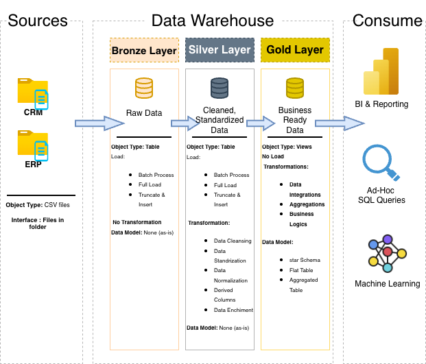

# Data Warehouse and Analytics Porject
---

Welcome to the **Data Warehouse and Analyticss Project** repository! 
This project demonstrates a comprehensive data Warehousing and analytics solutio, from building a data warehouse to generating actionable insights. Designed as a portfolio project highlights industry best parctices in dta engineering and analytics.

---
# Data Architecture

The data architecture for this project follows Medallion Architecture **Bronze, Silver** and **Gold**
layers:

1. **Bronze Layer**: Stores raw data as-is from the source systems. Data is ingested from CSV Files into SQL Server Database.
2. **Silver Layer**: This layer includes data cleansing, standardization, and normalization processes to prepare data for analysis.
3. **Gold Layer**: Houses business-ready data modeled into a star schema required for reporting and analytics.

---
# Project Overview
This project involves:

1. **Data Architecture**: Designing a Modern Data Warehouse Using Medallion Architecture Bronze, Silver, and Gold layers.
2. **ETL Pipelines**: Extracting, transforming, and loading data from source systems into the warehouse.
3. **Data Modeling**: Developing fact and dimension tables optimized for analytical queries.
4. **Analytics & Reporting**: Creating SQL-based reports and dashboards for actionable insights.

---

#  Project Requirements
### Building the Data Warehouse (Data Engineering)

#### Objective
Develop a modern data warehouse using SQL Server to consolidate sales data, enabling analytical reporting and informed decision-making.

#### Specifications
**Data Sources**: Import data from two source systems (ERP and CRM) provided as CSV files.
**Data Quality**: Cleanse and resolve data quality issues prior to analysis.
**Integration**: Combine both sources into a single, user-friendly data model designed for analytical queries.
**Scope**: Focus on the latest dataset only; historization of data is not required.
**Documentation**: Provide clear documentation on the data model to support both business stakeholders and analytics teams.

---

### BI: Analytics & Reporting (Data Analytics)

#### Objective
Develop SQL-based analytics to deliver detailed insights into:
**Customer Behavior**
**Product Performance**
**Sales Trends**
These insights empower stakeholders with key business metrics, enabling strategic decision-making.

---
## License
This project is licensed under the [MIT License](LICENSE).- You are free to use, modify, and share this project with proper attribution.

## About Me
Hi there! I'm **Winnie Happi**, a **graduate student** in Data Science and an aspiring data professional eager to grow my career by applying analytical skills to real-world challenges. 
Connect with me on LinkedIn

